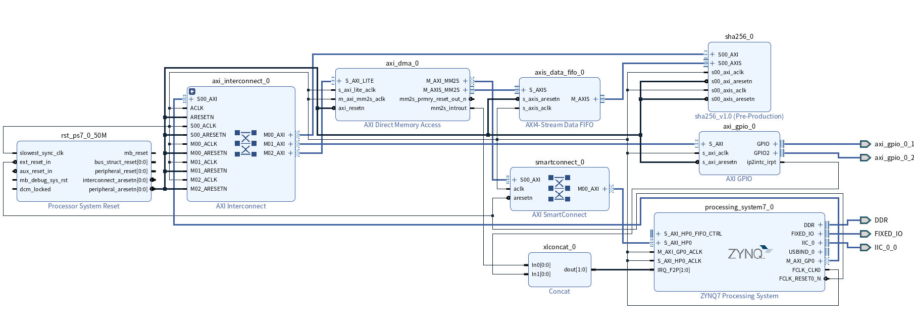
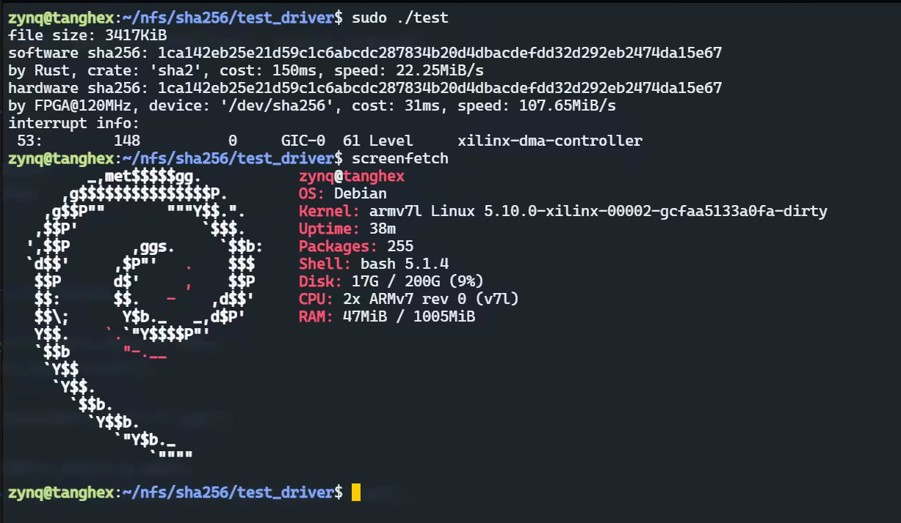
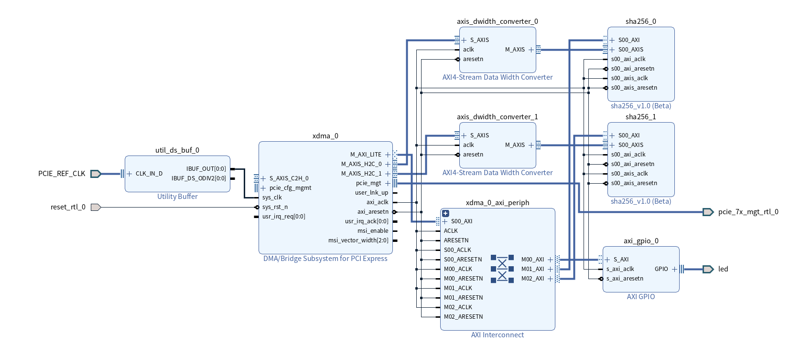
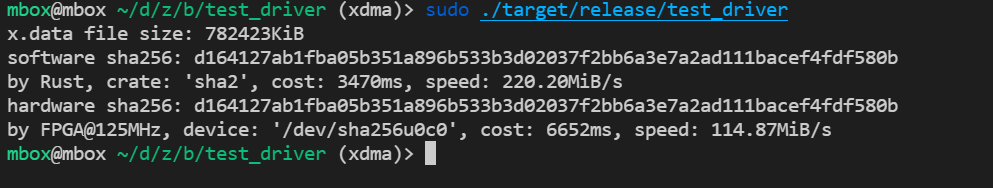

# zynq_sha256

IP Core of SHA256 algorithm, support AXI4-Lite, AXI4-Full, AXI4-Stream interface.
* Test passed with ZYNQ7020@120MHz with DMA and AXI-Stream mode
* Test passed with KINTEX325t@125MHz with PCIE2.0x2 

## FOR ZYNQ
### Block diagram

### Test

## FOR KINTEX WITH PCIE

### Block diagram

### Test (platform: intel 10400, **page aligned memory required!**)

